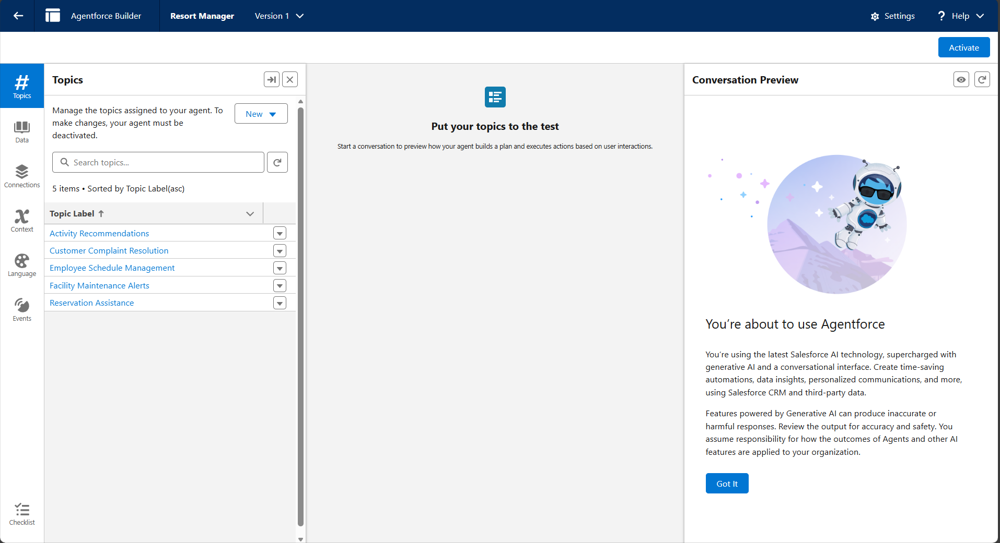
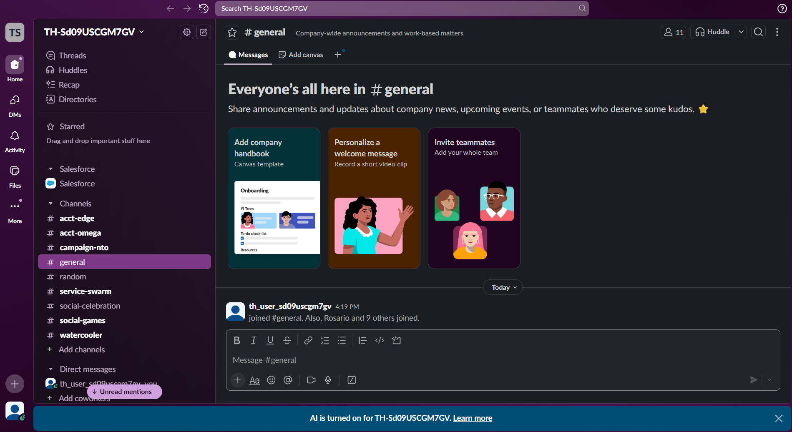

#  Salesforce Agentforce DX + Slack Integration  
*A Hands-On Learning Project — Salesforce Dream Quest 2025*   
**License:** Free to Use, Learn & Explore  

---

##  Overview  
This repository contains the complete setup and configuration work I performed while completing **Salesforce Dream Quest 2025** — specifically the **Agentforce DX** project and **Slack Integration** project.

This journey involved:
- Connecting a special Agentforce Developer Edition org  
- Enabling Einstein, Agentforce, and Bots  
- Creating an Agentforce DX project  
- Generating metadata through Salesforce CLI  
- Connecting Salesforce with Slack  
- Activating the integration  
- Mapping and authorizing Slack users  
- Testing end-to-end communication between Slack and Salesforce  

This project was a **learning-based integration**, not a coding project.  
All metadata and folders were automatically generated using Salesforce tools (CLI, VS Code, Trailhead modules).

---

##  **What This Project Demonstrates**
 Agentforce DX (Salesforce development workflow)  
 Authorization of a Salesforce Org using Salesforce CLI  
 Retrieval & deployment of metadata  
 Slack ↔ Salesforce integration  
 Activation of Slack connector  
 User mapping for secure access  
 A complete AI-powered agent configuration experience  

---

##  **Technologies Used**
- **Salesforce Agentforce**  
- **Salesforce Developer Edition Org**  
- **VS Code + Salesforce Extensions**  
- **Salesforce CLI (sf)**  
- **Slack Developer Playground**  
- **Slack Platform Connector**  

---

##  **Project Structure**
This project was generated automatically by Salesforce DX tools.

Key folders:
force-app/
specs/
scripts/
config/
screenshots/ 

Key files:
agentSpec.yaml
sfdx-project.json
package.json
.gitignore
README.md

---

##  **Screenshots**

###  1. Agentforce Adventure Tools (Testing the Dice Roller)

###  2. Slack Integration — Salesforce Connection Activated

###  3. VS Code — Agentforce DX Project Metadata

---

##  **Learning Outcomes**
During this project, I learned:

- How Salesforce agents are built using metadata  
- How to use Salesforce DX for real enterprise workflows  
- How Slack integrates securely with Salesforce  
- How OAuth, domain URLs, and user mappings work  
- How enterprise tools operate in real-world orgs  
- How to document and publish Salesforce projects professionally  

---

##  **Why This Project Matters**
This project:
- Is part of **Salesforce Dream Quest 2025**
- Required hands-on configuration across multiple platforms  
- Demonstrates real enterprise integration skills  
- Adds strong value to my GitHub & LinkedIn portfolio  

---

##  **Author**
**Mukul Tiwari**  
B.Tech CSE (AIML)   

---

## 📜 **License**
This project is free to use and learn from.

---

##  Show Support  
If you found this useful, feel free to ⭐ star the repository on GitHub!

